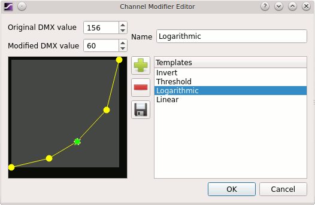

This window displays a tree with items nested in a Universes/Fixtures/Channels structure.  
On the right side of each fixture's channel are displayed the available options that can be set to modify the behaviour of each single channel.

Channels properties
-------------------

|     |     |
| --- | --- |
| **Can fade** | Determine if a channel is included or excluded in the QLC+ fade transitions.   By default all the channels are affected by the Fade In and Fade Out timings of the QLC+ functions.   When this property is unchecked, a channel will not fade, meaning that a fade transition from 20 to 200, will set the channel immediately to 200.   This is useful for example for Pan/Tilt channels of moving heads, where you want the motors to avoid fading but immediately go to the final value. |
| **Behaviour** | Force the channel behaviour according to the [HTP](/basics/glossary-and-concepts#htp) and [LTP](/basics/glossary-and-concepts#ltp) rules. When changing the behaviour of a channel, the dropdown list will highlight in red, showing evidence that the channels has been modified.   **Note: Use this functionality only if you know what you're doing and fully understand how HTP and LTP work** |
| **Modifier** | Channels modifiers are a powerful tool to modify the behaviour of a channel by acting at the end of the DMX value calculation, right before the [Grand Master](/basics/glossary-and-concepts#grand-master) modification.   By default all the channels will follow a linear rule, meaning that the original DMX value will be equal to the output DMX value. (0-0, 1-1, ... , 255-255)   When clicking on this button, the Channel Modifier Editor panel (described below) will be displayed. |

When dealing with a lot of fixtures of the same type, you might want to check the "Apply changes to fixtures of the same type" check box.  
This means that changing a channel property will affect all the channels of the same type and fixture in the list.  
This can save you quite a lot of time when setting up your projects for the first time.

Channel Modifier Editor
-----------------------

The channel modifier editor is presented like this:

On the right side of the window, a list of available modifier templates is displayed.  
Clicking on a template in the list, will show the curve preview on the left side of the window.  
A modifier curve is composed by a number of lines representing how a DMX channel should be modified when its value changes.  
Each line starts and ends with a so called "handler". A modifier can have a virtually infinite number of handlers, but there must be always one handler on the DMX value 0 and one handler on the DMX value 255 to cover all the DMX values range.  
Basically the X coordinate of the preview represents the original DMX value and the Y coordinate represents the modified DMX value.  
When clicking on a handler this gets clearer as the fields above the curve preview are filled with the said values.  
Handlers can be simply moved with the mouse by dragging them around or by manually changing the values of the original or modified DMX values.

To create a new template just select an existing template, give it a new name and add/remove handlers as needed with the  and  buttons.  
When done, just click the  button and your template will be saved in your user templates folder. Please refer to the [Questions and Answers](/basics/questions-and-answers) page to locate this folder.

Channel Modifier Templates
--------------------------

QLC+ delivers a few templates that might cover the most common cases.

|     |     |
| --- | --- |
| **Always Full** | Fix ("park") the channel value to 100% (255), regardless of other QLC+ mechanisms (except blackout and universe passthrough). Useful for e.g. dimmer channels. |
| **Always Half** | Fix ("park") the channel value to 50% (127). Useful for keeping Pan/Tilt channels at a neutral position. |
| **Always Off** | Fix ("park") the channel value to 0% (0). Useful for disabling wrong fixtures. |
| **Exponential Deep** |     |
| **Exponential Medium** |     |
| **Exponential Shallow** |     |
| **Exponential Simple** |     |
| **Inverted** | Invert a Pan/Tilt channel where a product doesn't have this feature by factory default. |
| **Linear** | Default curve, same as when no modifier is set. |
| **Logarithmic Deep** | This template can improve the fade transitions of LED-based fixtures, trying to bring them back to a more linear effect |
| **Logarithmic Medium** |
| **Logarithmic Shallow** |
| **Preheat 5%** | May extend lamp life by keeping them at 5% minimum |
| **Threshold** | Converts dimmer channel to switch channel (off below 128, full above) |