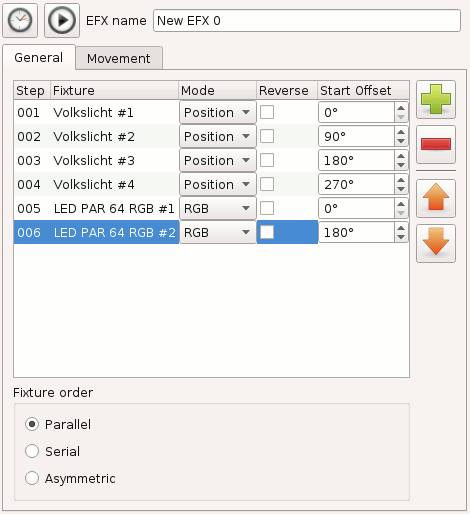
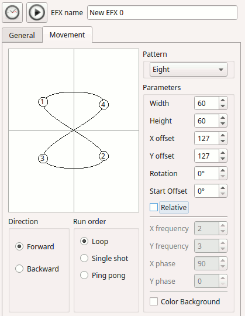

Der EFX-Editor wird, wie der Name schon sagt, zum Bearbeiten von  [EFX](/basics/glossary-and-concepts#efx)-Funktionen verwendet. Die Ansicht ist in zwei Registerkarten unterteilt:

* Auf der Registerkarte „Allgemein“ können Sie [Geräte](/basics/glossary-and-concepts#fixtures), Geschwindigkeit und Gerätereihenfolge auswählen.
* Auf der Registerkarte **Bewegung** können Sie Details dazu auswählen, wie die Geräte ihre Strahlen bewegen sollen.

### Allgemeine Tab-Steuerelemente

|     |     |
| --- | --- |
|  | Passen Sie die EFX-Geschwindigkeitseinstellungen an:  **Einblenden:** Blendet den EFX-Start auf die Zielgröße ein **Ausblenden:** Wird derzeit nicht verwendet **Dauer:** Die Dauer einer ganzen Runde mit dem ausgewählten Muster |
|  | Aktivieren Sie die Ausgabe und führen Sie EFX aus, um zu testen, wie sie aussieht |
| **EFX-Name** | Ändern Sie den Namen des EFX. |
| **Spielplan** | **Schritt**: Zeigt die Reihenfolge an, in der die Geräte ihre Bewegung in serieller/asymmetrischer Reihenfolge beginnen **Gerät**: Der Name jedes Geräts, das dem EFX hinzugefügt wurde **Modus** : Die Kanäle, die der EFX steuern soll. Sie können **Position**, **Dimmer** oder **RGB** sein.  *Hinweis*: Bei der Auswahl von RGB möchten Sie möglicherweise den unten beschriebenen „Farbhintergrund“ aktivieren. **Umgekehrt **: Wenn diese Option aktiviert ist, kehrt das Gerät seine Bewegung um, im Gegensatz zu nicht umgekehrten Geräten. Die „normale“ Richtung wird durch die Richtung auf der Seite „Bewegung“ festgelegt. **Start Offset**: Wert in Grad, wo auf dem Bewegungspfad dieses Gerät beginnen soll |
|  | Fügen Sie nach der aktuell ausgewählten Position eine [Fixture](/basics/glossary-and-concepts#fixtures) zum EFX hinzu. Da EFX zum Bewegen des Kopfes oder Spiegels eines intelligenten Geräts verwendet wird, können einem EFX nur Geräte mit **Schwenk- und Neigefunktion** (8 Bit oder 16 Bit) hinzugefügt werden. |
|  | Entfernen Sie die ausgewählten Geräte aus dem EFX. |
|  | Heben Sie das ausgewählte Gerät (zuvor) der Reihe nach nach oben. |
|  | Senken Sie die ausgewählte Vorrichtung (später) der Reihe nach nach unten ab. |
| **Beleuchtungsreihenfolge** | Ändern Sie die Fixture-Reihenfolge des EFX – siehe unten. |

### Steuerelemente auf der Registerkarte „Bewegung“.

|     |     |
| --- | --- |
| **Musterbereich** | Zeigt eine 2D-Projektion der Kopf-/Spiegelbewegung der Geräte. Jedes Mal, wenn Sie einen Parameter ändern, bewegt sich ein kleiner Punkt für jedes Gerät ab seinem Startversatz über den gesamten Pfad in der ausgewählten Richtung.  Die Geschwindigkeit der Bewegung spiegelt die ausgewählten Geschwindigkeitseinstellungen wider. |
| **Richtung** | Standardrichtung der Geräte (kann für jedes Gerät einzeln durch das Kontrollkästchen in der Spalte **Umkehren** geändert werden)  **Vorwärts**: Die Geräte bewegen sich vorwärts entlang des Musterpfads ** Rückwärts**: Die Vorrichtungen bewegen sich entlang des Musterpfads rückwärts |
| **Reihenfolge ausführen** | **Schleife**: Laufen Sie immer wieder durch die Stufen. **Einzelschuss**: Laufen Sie einmal durch die Stufen und halten Sie dann an. **Ping Pong**: Laufen Sie immer wieder durch die Stufen noch einmal, wobei die Richtung an beiden Enden umgekehrt wird. |
| **Muster** | Wählen Sie den Bewegungsmusteralgorithmus aus.  **Kreis** **Acht** **Linie**: geht von einem Ende zum anderen und zurück; schneller in der Mitte, langsamer an den Enden **Linie2**: geht nur in eine Richtung; Geschwindigkeit ist immer gleich **Diamond** **Square** **SquareChoppy** **Leaf** **Lissajous** |
| **Parameter** | **Breite**: Wählen Sie die Schwenkbreite (0-255) **Höhe**: Wählen Sie die Neigungshöhe (0-255) **X-Versatz**: Verschieben Sie die Horizontale des Musters (Schwenken) Mittelpunkt (0-255) **Y-Versatz**: Verschieben Sie den vertikalen (Neigungs-)Mittelpunkt des Musters (0-255) **Rotation**: Drehen Sie das Muster entlang seiner Achse (0-360). Grad) **Anfang Versatz**: Wo entlang des Pfads die Bewegung beginnen soll (0–360 Grad) **X-Frequenz**: Ändern Sie die X-Frequenz (horizontal) des **Lissajous**-Musters (0–32) * *Y-Frequenz**: Ändert die Y-Frequenz (vertikal) des **Lissajous**-Musters (0-32) **X-Phase**: Ändert die X-Phase (horizontal) des **Lissajous**-Musters (0-32) 360 Grad) **Y-Phase**: Ändern Sie die Y-Phase (vertikal) des **Lissajous**-Musters (0-360 Grad) |
| **Farbiger Hintergrund** | Wenn diese Option aktiviert ist, zeigt der EFX-Vorschauhintergrund eine RGB-Palette an, um zu zeigen, was EFX bei der Steuerung von RGB-Kanälen tut |
| **Relativ** | Siehe unten. |

### Vorrichtungsreihenfolge

Geräte, die an einer EFX-Funktion teilnehmen, können so eingestellt werden, dass sie dem Algorithmus in einer bestimmten Reihenfolge folgen:

* **Parallel:** Alle Geräte folgen synchron demselben Muster
* **Seriell:** Die Geräte folgen nacheinander dem Muster, mit einer kleinen Verzögerung zwischen den einzelnen Geräten.
* **Asymmetrisch:** Alle Geräte beginnen sich gleichzeitig zu bewegen, jedoch mit einem ähnlichen Versatz wie im seriellen Modus.

### Richtung

Die Richtung der EFX-Funktionen kann für alle Geräte gleichzeitig oder pro Gerät umgekehrt werden. Die Funktion kann auch so eingestellt werden, dass sie eine Endlosschleife durchführt, eine unendliche Ping-Pong-Schleife (die Richtung wird nach jedem Durchgang umgekehrt) oder sie kann nur einmal im Single-Shot-Modus durchlaufen und danach von selbst beendet werden. Wenn die Funktion auf eine Endlosschleife eingestellt ist, muss sie manuell gestoppt werden.

### Relativer Modus

Die EFX-Position ist standardmäßig absolut – mit anderen Worten, der ausgewählte EFX steuert ausschließlich die X/Y-Position der angegebenen Köpfe. Wenn das Kontrollkästchen „Relativer Modus“ aktiviert ist, fungiert die EFX-Position als Ebene über jeder Position, die bereits festgelegt wurde (z. B. durch eine Szene oder sogar einen anderen EFX). Mit anderen Worten, der EFX ist relativ zur aktuellen Fixture-Position.

Im absoluten Modus. Der EFX kann so eingestellt werden, dass er an einer bestimmten Kopfposition läuft (z. B. Kreise in der Mitte der Bühne, links auf der Bühne usw.).

Im relativen Modus wird die Mitte des Vorschaufensters (Versatz x=127, Versatz y=127) auf die aktuelle Kopfposition angewendet.

Es ist nützlich, die Anzahl der EFX-Voreinstellungen zu reduzieren: Nehmen wir an, wir möchten drei Arten von EFX (Pan Saw, Tilt Saw, Circle) an 4 Stellen (z. B. 4 Bühnenecken) haben. Im absoluten Modus bedeutet das 3x4 = 12 Presets. Wenn wir etwas ändern wollen, müssen wir viele Funktionen bearbeiten. Wir benötigen höchstwahrscheinlich auch jeweils eine VC-Taste. Im relativen Modus erstellen wir eine EFX-Voreinstellung für jeden EFX-Typ (Pan Saw, Tilt Saw, Circle) und stellen den Offset auf Neutral (x=127, y=127). Anschließend erstellen wir Szenen mit PAN- und TILT-Kanälen für jede Position. Jetzt haben wir nur noch 3+4 Presets (und 3+4 VC-Tasten, vorzugsweise in 2 Solo-Frames).

**Tipps und Tricks**

Im relativen Modus ist es auch möglich, zwischen Positionen zu überblenden (Fade-Zeit in Szenen einstellen), während der EFX läuft.

Mit XYPad und dem relativen Modus ist es möglich, EFX während der Show an eine beliebige Stelle zu verschieben.

Beim Ansteuern von RGB-Kanälen:
* Um zu sehen, was Sie tun, aktivieren Sie das Kontrollkästchen **Hintergrundfarbe**.
* **X-Offset** legt eine Grundfarbe fest (z. B. Blau = 167).
* **Höhe** legt den Farbbereich fest (z. B. 40 legt den Bereich von Cyan über Blau bis Magenta fest).
* **Y-Offset** legt die Basisintensität fest.
* **Breite** legt den Intensitätsbereich fest.

Die obere Hälfte der Y-Achse variiert die Farbe von Schwarz (oben) bis zur Grundfarbe (Mitte, z. B. Blau).
Die untere Hälfte der Y-Achse variiert die Farbe von der Grundfarbe (Mittel, z. B. Blau) bis zu Weiß (unten).
