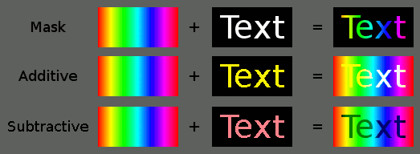

The RGB matrix editor, as its name suggests, is used to edit  [RGB matrix](/basics/glossary-and-concepts#rgb-matrix) functions. The function works on predefined  [Fixture Groups](/basics/glossary-and-concepts#fixture-group) created by the user with the  [Fixture Manager](/fixture-manager).

Controls
--------

|     |     |
| --- | --- |
| **RGB matrix name** | Change the name of the RGB matrix. |
|  | Adjust the RGB Matrix speed settings:  **Fade In:** The time it takes for the fixtures in the RGB Matrix fixture group to fade their intensity channels up **Fade Out:** The time it takes for the fixtures in the RGB Matrix fixture group to fade their intensity channels back to zero **Duration:** The duration of each step of the selected pattern |
|  | Convert the current RGB Matrix into a [Sequence](/basics/glossary-and-concepts#sequence). This is useful to speed up the creation of a [Show](/basics/glossary-and-concepts#show). Please note that if the selected pattern generates random data, this functionality will generate a different Sequence every time. |
|  | Switch the preview mode between circles and squares |
|  | Make the RGB Matrix run as if it were started from a [Virtual Console](virtualconsole.html) button. Note that the preview stops while the function is running. |
| **Fixture group** | The [Fixture Group](/basics/glossary-and-concepts#fixture-group) that is controlled by this RGB matrix. |
| **Preview area** | Shows a preview of the currently selected pattern imposed on the fixtures defined in the currently selected fixture group. Note that the preview doesn't show the difference between RGB-capable and monochrome/fixed color fixtures. |
| **Pattern** | Select the pattern and colors that are used on the selected fixture group for drawing graphics.   Patterns can be:  **Plain Color**: all the pixels of the matrix will be lit to the selected color    **Animated Text**: display an animated text with the following parameters:     * The text edit field is used to edit the text content that is scrolled/flashed on the matrix.     * The font button  is used to select the font (tip: bitmap fonts work best)     * The drop-down box is used to select the animation style (Horizontal, Vertical or Letters)    **Audio Spectrum**: QLC+ will start capturing data from the chosen audio input device and will represent the audio spectrum as vertical bars in the RGB Matrix with the selected start and end color.       For an optimal usage of this pattern, the hold time of the Matrix must be set to a reasonably low value (e.g. .20)    **Image**: display an image loaded from a file, with the following parameters:          * The text edit field is used to edit the image filename     * The image button  is used to load an image from file     * The drop-down box is used to select the animation style (Static, Horizontal, Vertical or Animation)          Supported formats: PNG, XPM, JPG, GIF (for animated gifs only first frame is used).          Styles:      **Static** \- the image is statically displayed on the matrix. If the image is smaller than the matrix, it is repeated in both directions. (Tip: for stripes, use 1-point-high images) **Horizontal** \- the image is scrolled horizontaly. Again, image is repeated in both directions.  **Vertical** \- same as **Horizontal**, but in vertical direction.     * **Animation** \- play animation. Stack the frames (of width equal to matrix's) side by side in one image. For example, when matrix is 8x8 and you want to have 4 frames, make image 32x8. The image is still repeated vertically.    The rest of the pattern list is filled with [RGB Scripts](/basics/glossary-and-concepts#rgb-script) loaded when QLC+ starts up.   Depending on the selected pattern, it is possible to choose a start and an end color. Some patterns do not allow colors at all (since they elapse them autonomously) or allow just one color. |
| **Pattern Blend Mode** | The blend mode is the mechanism used to mix multiple RGB Matrices running one on top of the other.   Here's a representation of how it works:    The matrix running on the bottom layer must use the default mode, to prepare a ground of colors that all the above layers can use to perform blending. |
| **Pattern Color Mode** | The color mode is the mechanism select which color channels the RGB Matrices applies to.   Default setting is RGB mode, addressing RGB channels or CMY channels. If set otherwise, only the selected channels (e.g. "White") whill be set in a grayscale of the selected color(s). Channels not representing the selected color mode (e.g. R, G and B) will not be touched. |
| **Offset** | Available only when **Text** or **Image** is the selected pattern.  **X:** Used to shift the pattern along the horizontal x-axis (negative values go to the left, positive values go to the right) **Y:** Used to shift the pattern along the vertical y-axis (negative values go up, positive values go down) |
| **Run Order** | **Loop:** Run through the steps over and over again. **Single Shot:** Run through the steps once and then stop. **Ping Pong:** Run through the steps over and over again, reversing direction at both ends. |
| **Direction** | **Forward:** Run through the steps from start to end; 1, 2, 3... **Backward:** Run through the steps from end to start; ...3, 2, 1 |
| **Other Controls** | **Dimmer control:** When enabled, dimmer channel of include fixtures will be set to 100% when the matrix is running. Uncheck if you want independent intensity control. |