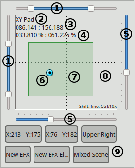
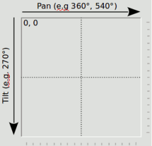
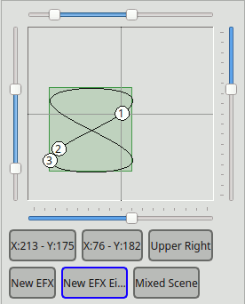

XY Pad is a Virtual Console widget dedicated to fixtures positioning.  
It can handle the typical DMX movement channels (**pan** and **tilt**) of intelligent lighting fixtures, namely scanners and moving heads.  
The pad is a resizable area, surrounded by several controls to cover the needs you might have during a live show.  
It is displayed as following:

### Widget elements

|     |     |
| --- | --- |
| **(1) Range sliders** | These sliders limit the working area. (7) |
| **(2) XY Pad name** | The name can be changed in properties, see below. |
| **(3) DMX Coordinates** | This part displays current DMX coordinates in format (Pan course.Pan fine : Tilt course.Tilt fine). |
| **(4) Horizontal and vertical angle** | If the fixtures controlled have proper pan and tilt range filled in in their definitions, and the range is same for all fixtures, then this text will show the angle calculated from DMX coordinates.   0° is in the middle of the range (DMX value 127.127). For example, if pan range for a fixture is 540°, the displayed angle will be between -270° and 270°.   Note: this may not work properly, when a fixture has limited axis range in configuration, or reversed axis. |
| **(5) Value sliders** | These sliders can be used to change value of the X/Y axes. |
| **(6) Handle** | The blue point is the handle. You can move it either with the mouse, with the keyboard or an external controller. |
| **(7) Working area** | This is the area that limits the possible positions. It can be equal or a portion of (8) |
| **(8) Main area** | This is the area representing all the possible X/Y positions. |
| **(9) Presets** | This is the area showing the preset buttons, if available. |

### Limiting the working area

The XY Pad is basically a map of the whole range of degrees that the pan and tilt channels of your fixtures can manage.  
Here's a picture representing how the main area normally represents degrees:

  

There are cases though where you want to limit the degrees a moving head or a scanner could reach.  
For example fixtures with a 540° Pan range, should be limited to work only in a range facing the audience, or you might want to avoid that moving heads mounted upside down on a truss will point to the ceiling or outside the stage.  
With the XY Pad, there are 2 ways to achieve this:

**1\. Working window**

With the top and left range sliders **(1)**, it is possible to limit the area where the XY Pad will work.  
When reducing the range of those sliders, a semi transparent green area **(7)** will be highlighted on top of the main area, to mark the X/Y limits where your fixtures should operate.  
Note that when using a mouse on the user interface, the movement of the handles will be limited to the working window, even if you drag the cursor outside of it, while when using an external controller all the values will be scaled to the window, so you will be able to use the full range of a physical fader, thus having more sensitivity when setting a position.

**2\. Individual fixture range**

It is possible to set a specific range for each fixture in the properties dialog (see the **Configuration** paragraph). With this method, the whole main area **(8)** is used and every specified range of each fixture is scaled onto it.  
This come very handy when you want to use a XY Pad with mixed fixtures, with different ranges of degrees.  

For example you can make a 540° degrees Pan to move exactly like a 360° degrees Pan.

Another example: set fixture X Axis (Pan) minimum to 20% (DMX value 51), maximum to 80% (DMX value 204). When the handle is at the left edge (value 0), the actual DMX output is 51. Similarly, handle at the right edge will output 204 (=80%). For values in between, the DMX output is scaled proportionally.

It is possible to have both limits enabled (using the range sliders and limits per fixtures).

### XY Pad usages

The XY Pad allows 3 completely different usages, but all targeted to positioning. It's up to you to decide the best use of them depending on your needs. You also might want to consider the usage of multiple XY Pads with different purposes.  

* **1- Absolute positioning**: this is the basic usage and it requires only to specify which fixtures you intend to control (added via Configuration window) and eventually their specific range of operation.  
    As previosuly described all you need to do is to setup your fixtures once and start moving them with your favourite controller.  
    It is also possible to define some position presets, so a number of buttons will be displayed in **(9)** to quickly recall an absolute position.  
    If a Fixture Group preset is activated, the XY Pad will control the absolute positions only of the Fixtures defined in the preset. (see Presets tab for more info)
  
* **2- EFX**: In the Configuration window (Presets tab), it is possible to add some presets to recall existing  [EFX](/basics/glossary-and-concepts#efx) functions. When activating a EFX preset, the animated preview of the fixtures movements will be displayed like this:  
      
    If no working window is set, the EFX will be be displayed exactly like it is previewed in the [EFX Editor](../function-manager/efx-editor). Otherwise, the EFX will be scaled to fit the defined working window.  
    If a working window is active, it will be shared between usage #1 and usage #2.
  
* **3- Relative to a Scene**: In the Configuration window (Presets tab), it is also possible to add some presets to recall existing  [Scene](/basics/glossary-and-concepts#scene) functions  
    XY Pad will detect which Pan/Tilt channels are present in the Scene and set them.  
    The Pad handle **(6)** will automatically position itself to the center of the main area **(8)**. Moving the handle, will produce relative values from the center of the Pad, that will be added/subtracted to the DMX values of the running Scene.  
    Moving up will add a negative offset to Tilt channels and moving down will add a positive offset.  
    Moving left will add a negative offset to Pan channels and moving right will add a positive offset.  
    When activating a Scene preset, is a working window is active, it will be hidden, as there's no absolute values involved in this usage. When switching back to usage #1 or #2, the working window will be restored.  
    Please note that when a Scene preset is activated, the whole Scene will be actually started, with colors and everything. It is suggested in this case to create Scenes only with Pan/Tilt channels enabled, not to involve a XY Pad in other matters.

### Keyboard control

It is possible to control head position with arrow keys on the keyboard. Each keypress increases/decreases coarse value by 1. With Shift key pressed, fine channel is changed by 1. With Ctrl, the step is 10 instead of 1.

|     |     |     |
| --- | --- | --- |
| **Arrow keys** | Coarse | step=1 |
| **Shift + Arrow keys** | Fine | step=1 |
| **Ctrl + Arrow keys** | Coarse | step=10 |
| **Shift + Ctrl + Arrow keys** | Fine | step=10 |

### Configuration

XY Pads can be configured with the properties  button found in the toolbar or by double clicking on the XY pad itself.

**1\. General tab**

Here you can set the basic XY Pad behaviour as well as the external input controls.  
**Hint:** When assigning a XY pad from Touch OSC, you need to click the "Tilt / Vertical axis" auto detect button, otherwise the X and Y axes will be swapped.

|     |     |
| --- | --- |
| **XY Pad name** | Set the name of the XY Pad. The name **(2)** is shown in the upper left hand corner of the widget on Virtual Console. |
| **Y-Axis slider movement** | The behaviour of the vertical slider (the Y-Axis control) can be set to **Normal** or **Inverted**.   In the first case the maximum value will be reached at the bottom of the pad, while in the second case it will be reached at the top. |
| **Pan / Horizontal Axis** | Allow to select an external input to control the horizontal slider displayed at the bottom of the widget. When activating a EFX preset, this input will control the X position of the working window, so the X position of the EFX. |
| **Tilt / Vertical Axis** | Allow to select an external input to control the vertical slider displayed at the right side of the widget. When activating a EFX preset, this input will control the Y position of the working window, so the Y position of the EFX. |
| **Width** | Allow to select an external input to control the width of the working window. This has no effect in usage #1 and #3 |
| **Height** | Allow to select an external input to control the height of the working window. This has no effect in usage #1 and #3 |

  
**2\. Fixtures tab**

Here you can add/remove the fixtures that the XY Pad will control in usage #1.

|     |     |
| --- | --- |
| **Fixtures list** | Shows the fixtures that are currently controlled by the XY Pad.  **Fixture**: The names of each fixture **X-Axis**: Shows the value range (and reversal if applicable) of the horizontal (Pan) axis for each fixture **Y-Axis**: Shows the value range (and reversal if applicable) of the vertical (Tilt) axis for each fixture |
|  | Add [Fixtures](/basics/glossary-and-concepts#fixture) to be controlled by the XY Pad, using the [Select Fixture](../function-manager/select-fixture) dialog.   **NOTE**: Only those fixtures that have Pan and Tilt channels are shown in the dialog. |
|  | Remove the selected fixtures from the XY Pad's control list. |
|  | Edit the selected fixture's behaviour as controlled by the XY Pad. |

  
 ** 2.1 Fixture movement configuration**

You can change the extent of movement and reverse fixtures' movement with the XY Pad Fixture Configuration dialog.

|     |     |
| --- | --- |
| **Horizontal X-Axis** | **Minimum**: Set the minimum pan limit for the fixture **Maximum**: Set the maximum pan limit for the fixture **Reverse**: Reverse fixture's movement on the horizontal (pan) axis |
| **Vertical Y-Axis** | **Minimum**: Set the minimum tilt limit for the fixture **Maximum**: Set the maximum tilt limit for the fixture **Reverse**: Reverse fixture's movement on the vertical (tilt) axis |

  
**3\. Presets tab**

Here you can add/remove presets to the XY Pad. Each preset is displayed as a button in the lower part of the XY Pad widget. EFX nad Scenes presets can be toggled, to start/stop a function, Fixture Groups presets can be toggled to activate/deactivate a Fxiture group, while Position presets can be clicked just once

|     |     |
| --- | --- |
| **Presets list** | Show the list of the presets currently added to the XY Pad |
|  Add position | When clicking on this button, a new position preset is created and added to the XY Pad. By default the preset name are the X/Y coordinates at the moment of the creation |
|  Add EFX | When clicking on this button, the [Select Function](../function-manager/function-selection) dialog is displayed, allowing you to choose an existing EFX from your workspace.   When done, a new EFX preset is created and added to the XY Pad. By default the preset name is the EFX name |
|  Add Scene | When clicking on this button, the [Select Function](../function-manager/function-selection) dialog is displayed, allowing you to choose an existing Scene from your workspace.   When done, a new Scene preset is created and added to the XY Pad. By default the preset name is the Scene name.   Note that if the selected Scene doesn't have any Pan or Tilt channels, an error is displayed and no preset is created. |
|  Add Fixture Group | When clicking on this button, the [Select Fixture](../function-manager/select-fixture) dialog is displayed, allowing you to create a group of Fixtures as a subgroup of the Fixtures the XY Pad is controlling (defined in the Fixtures tab)   When clicking on a Fixture Group preset in Operate mode, the XY Pad will control only the Fixture positions of the activated Fixture Group.   **Note**: A Fixture Group preset has no effect on EFX and Scene presets. |
|  Remove | Removes the currently selected preset |
| Preset name | Allows to enter an arbitrary name for the currently selected preset |
| External input | Allows to select an external input control for the currently selected preset |
| Key combination | Allows to select a keyboard combination for the currently selected preset |