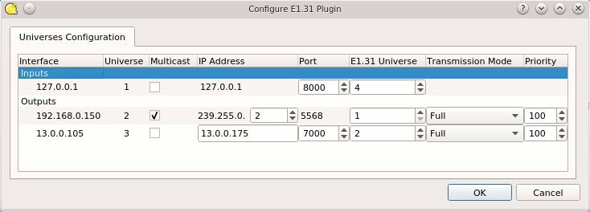

Einführung
------------

QLC+ unterstützt das [E1.31-Protokoll](https://www.opendmx.net/index.php/E1.31) (auch bekannt als s.ACN) über ein Eingabe-/Ausgabe-Plugin, das Pakete im Netzwerk empfängt und überträgt .  
Es sind keine zusätzlichen Anforderungen erforderlich, da QLC+ über eine native Implementierung des E1.31-Protokolls verfügt, das auf Linux-, Windows- und OSX-Systemen funktioniert.  
Das E1.31-Plugin kann Pakete von mehreren Netzwerkkarten, virtuellen Adressen, dem Loopback-Gerät (127.0.0.1) und mehreren Universen pro Netzwerkschnittstelle senden und empfangen.  
Standardmäßig werden E1.31-Pakete als UDP an Multicast-Adressen wie 239.255.0.x gesendet, wobei „x“ die in QLC+ ausgewählte Universumsnummer ist. Der verwendete Port ist 5568.  
Bei Verwendung des Loopback-Geräts werden Pakete immer über die Adresse 127.0.0.1 übertragen.  
Bei der Übertragung mehrerer Universen auf derselben Schnittstelle werden die Pakete standardmäßig mit einer E1.31-Universum-ID gesendet, die dem QLC+-Universum entspricht.  
  
Zum Beispiel:  
QLC+ Universum 1 -> E1.31 Universum 1 auf 239.255.0.1  
QLC+ Universum 2 -> E1.31 Universum 2 auf 239.255.0.2  
...  
QLC+ Universum 8 -> E1.31 Universum 8 auf 239.255.0.8  
  
Sollten die oben genannten Einstellungen nicht den Anforderungen Ihres Netzwerks entsprechen, lesen Sie bitte das folgende Kapitel.

Konfiguration
-------------

Wenn Sie auf die Konfigurationsschaltfläche  klicken, wird ein kleiner Dialog mit dem Bereich „Universenkonfiguration“ angezeigt.  
  
Nachdem ein QLC+-Universum mit einem E1.31-Ein- oder -Ausgang gepatcht wurde, wird in dieser Liste ein Eintrag angezeigt, der es ermöglicht, die gewünschten Parameter, die vom E1.31-Plugin verwendet werden sollen, manuell zu konfigurieren.  
Eingabezeilen können mit folgenden Parametern konfiguriert werden:  

|     |     |
| --- | --- |
| **Multicast** | Mit diesem Kontrollkästchen können Sie zwischen Multicast-Eingabe und Unicast-Eingabe wählen.   Wenn diese Option aktiviert ist, empfängt dieses Universum Pakete von der ausgewählten Multicast-Gruppe auf dieser Schnittstelle.   Wenn diese Option deaktiviert ist, empfängt dieses Universum Unicast-Pakete nur über diese IP-Adresse.   Die Auswahl des Unicast-Eingangs ermöglicht die Auswahl eines anderen Eingangsports. |
| **IP-Adresse** | Dies ist die Eingabe-IP-Adresse, die das E1.31-Plugin auf der ausgewählten Schnittstelle für dieses QLC+-Universum abhört.   Wenn der Eingang auf Multicast eingestellt ist, können Sie die Multicast-IP von 239.255.0.1 bis 239.255.0.255 auswählen.   Wenn der Eingang auf Unicast eingestellt ist, ist die IP-Adresse an die IP-Adresse der ausgewählten Schnittstelle gebunden. |
| **Hafen** | Dies ist der Eingangsport, den das E1.31-Plugin für dieses QLC+-Universum überwacht.   Wenn der Eingang auf Multicast eingestellt ist, ist der Port auf den Standard-E1.31-Multicast-Port gesperrt: 5568  Wenn der Eingang auf Unicast eingestellt ist, können Sie jeden gewünschten Port auswählen. |
| **E1.31 Universum** | Dies ist das E1.31-Eingabeuniversum, das das Plugin für dieses QLC+-Universum akzeptiert.   Dies ermöglicht die Zuordnung jedes E1.31-Universums zu jedem QLC+-Universum. |

  
Beispiel für eine Eingabekonfiguration:

Wenn in diesem Beispiel E1.31-Pakete an der Adresse 127.0.0.1 und Port 8000 empfangen werden, wirken sich die Pakete, die auf E1.31-Universum 4 laufen, auf QLC+-Universum 1 aus.  
Außerdem übertragen wir QLC+-Universum 2 auf der Multicast-Adresse 239.255.0.2, E1.31-Universum 1 und QLC+-Universum 3 auf der Unicast-Adresse 13.0.0.175, Port 7000, E1.31-Universum 2.  
  
Ausgabeleitungen können mit folgenden Parametern konfiguriert werden:  

|     |     |
| --- | --- |
| **Multicast** | Mit diesem Kontrollkästchen können Sie zwischen Multicast-Ausgabe und Unicast-Ausgabe wählen.   Wenn diese Option aktiviert ist, sendet dieses Universum Pakete an die ausgewählte Multicast-Gruppe auf dieser Schnittstelle.   Wenn diese Option deaktiviert ist, sendet dieses Universum Unicast-Pakete an die ausgewählte Unicast-IP-Adresse.   Wenn Sie „Unicast-Ausgabe“ auswählen, können Sie auch den ausgehenden Port auswählen. |
| **IP-Adresse** | Dies ist die Ziel-IP-Adresse, an die das E1.31-Plugin Pakete überträgt.   Standardmäßig wird eine Multicast-Adresse wie oben beschrieben verwendet.   Wenn der Ausgang auf Multicast eingestellt ist, können Sie diesen Parameter im Bereich von 1 bis 255 einstellen.   Dies ermöglicht das Senden von Paketen an den Multicast-Bereich 239.255.0.1 bis 239.255.0.255.   Wenn die Ausgabe auf Unicast eingestellt ist, können Sie eine beliebige IP-Adresse auswählen.   Beim Patchen eines QLC+-Universums auf das Loopback-Gerät (127.0.0.1) werden Unicast-Pakete immer an 127.0.0.1 übertragen. |
| **Hafen** | Dies ist der Port, auf den die ausgehenden Pakete abzielen.   Der Multicast-E1.31-Port ist immer 5568.  Wenn die Ausgabe auf Unicast eingestellt ist, können Sie einen beliebigen Port auswählen. |
| **E1.31 Universum** | Dies ist das E1.31-Universum, das tatsächlich in jedes übertragene Paket geschrieben wird.   Durch die Einstellung dieses Parameters können Sie jedes QLC+-Universum zur Übertragung an das gewünschte E1.31-Universum verwenden. |
| **Übertragungsmodus** | Hier können Sie auswählen, ob QLC+ vollständige oder teilweise Universen übertragen soll.   „Voll“ bedeutet, dass alle 512 DMX-Kanäle eines Universums mit der Geschwindigkeit des internen QLC+-Takts (50 Hz) übertragen werden, was eine feste Bitrate von etwa 200 kbps ergibt.   „Teilweise“ bedeutet stattdessen, dass QLC+ nur den tatsächlich in einem Universum verwendeten DMX-Kanal überträgt, beginnend mit Kanal 1. Wenn Sie beispielsweise Kanal 3 eines Geräts mit der Adresse 50 erhöhen, überträgt das E1.31-Plugin nur 53 DMX-Kanäle, wodurch die Übertragungsbitrate begrenzt ist.   Verwenden Sie diese Einstellung nur, wenn der empfangende E1.31-Knoten eine teilweise Übertragung unterstützt. |
| **Priorität** | E1.31 Quellenpriorität.   **0** ist die Mindestpriorität, **200** die Höchstpriorität und **100** die Standardpriorität.   Wenn der E1.31-Empfänger Daten für ein bestimmtes Universum aus mehreren Quellen erhält, verwendet er Daten aus der Quelle mit der höchsten Priorität.   Dies ermöglicht verschiedene Failover-Schemata. Beachten Sie, dass QLC+ die Priorität bei der Eingabe noch nicht anerkennt. |

  
Einstellungen, die von den Plugin-Standardeinstellungen abweichen, werden in Ihrem QLC+-Arbeitsbereich gespeichert, um die Portabilität eines Projekts über verschiedene Plattformen hinweg zu erhöhen, z. B. verschiedene Betriebssysteme oder einen PC und einen Raspberry Pi.

Kompatibilität
-------------

QLC+ wurde mit der folgenden E1.31-Software und -Geräten getestet:

* [DMXKing eDMX2 TX](https://dmxking.com/artnetsacn/edmx2-tx-rdm) \- Ausgabegerät