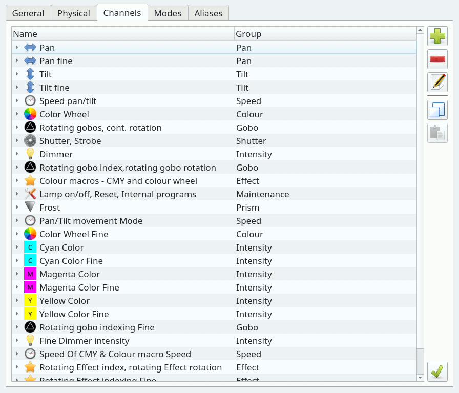
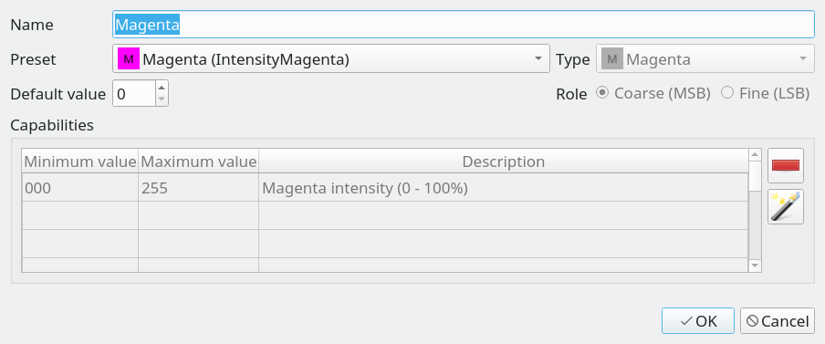
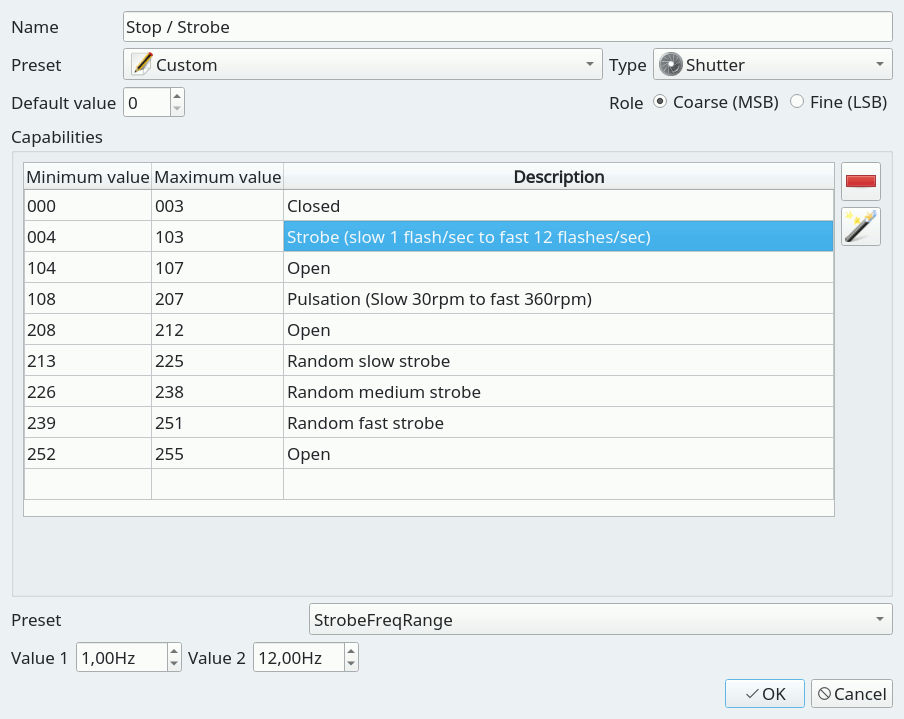
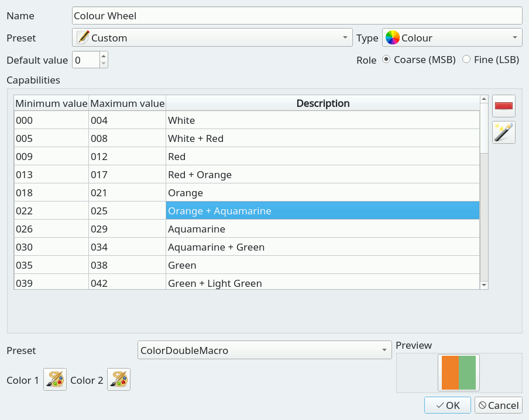
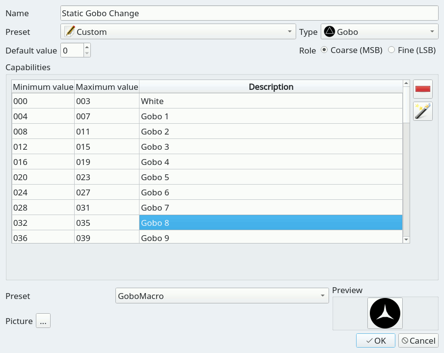
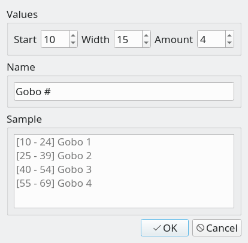

The channels tab contains all possible channels that the fixture understands in all of its modes. The channel order doesn't matter in this tab at all. Instead, channels are arranged in certain order in each mode in the **Mode** tab. On the **Channel** tab, only the channel names, their **capabilities** (i.e. value ranges and their purpose) matters.

|     |     |
| --- | --- |
|  | Add a new channel to the fixture using the [Channel Editor](#channel-editor) |
|  | Remove the selected channels from the fixture **and from all modes** |
|  | Edit the currently selected channel using the [Channel Editor](#channel-editor) |
|  | Copy the currently selected channel to the clipboard. Channels in the clipboard can also be pasted to other fixture definition windows |
|  | Paste a channel from clipboard to the fixture definition. Channels in the clipboard can also be pasted to other fixture definition windows |
|  | Expand or collapse all the channel nodes in the channel list |

### Channel Editor

The Channel Editor is used to edit individual channels and the DMX value ranges of each capability (a green color, a certain gobo, prism rotation, etc.) that a fixture channel provides. Refer to your fixture's manual to get a detailed list of the fixture's channels and DMX values.

Here's a few screenshots showing the possible scenarios that can be encountered while editing a Fixture channel.

Fig. 1

Fig. 2

Fig. 3

Fig. 4

Following, the description of the settings that appear in the Channel Editor. Reference to the above figures will be done to point you to a visual context.

|     |     |
| --- | --- |
| **Name** | The channel name. When selecting a channel preset (single capability channel), a channel name will be automatically suggested, with the possibility to customize it. |
| **Preset** | A preset is a sort of shortcut to speed up the definition creation. It also provides to the QLC+ engine, useful information to recognize and properly treat a DMX channel.   It frequently happens that a Fixture has some RGB or CMY channels. A LED bar might have dozens of them. Therefore, selecting a color preset will fill in for you all the necessary information that QLC+ needs, with a single mouse click. (See Fig. 1)   It is also frequent to find a channel to control Pan/Tilt speed. Some presets are available for that purpose, indicating also if the speed is from slow to fast or from fast to slow. Just pick the preset that is more suitable for the definition you're creating.   When a preset is selected, all the rest of the editor become inactive. If a channel has multiple DMX ranges (capabilities), just leave "Preset" to "Custom" and proceed further with this reading. |
| **Type** | This indicated the channel's type (its role in the fixture). Selecting a type, implicitely defines also the channel precedence ([LTP](/basics/glossary-and-concepts#ltp) or [HTP](/basics/glossary-and-concepts#htp)). It is therefore very important to pick the correct type here, to avoid undesired behaviours within QLC+.   All the intensity/color channel types obey to the **HTP** rule: **Intensity, Red, Green, Blue, Cyan, Magenta, Yellow, White, Amber, UV, Lime and Indigo**.   All the other types obey to the **LTP** rule: **Beam, Color, Effect, Gobo, Maintenance, Nothing, Pan, Tilt, Prism, Shutter and Speed**.    **Intensity** is used for dimmer / master dimmer channels.        **Primary colors** (Red, Cyan, White, etc) are used to control single color channels. Please do not confuse these types with the "Color" type (see below)       Note that the [Grand Master](/basics/glossary-and-concepts#grand-master) controls only Intensity and primary color channels by default. Note also that the Color Tool in [Scene Editor](/function-manager/scene-editor) is available only if a fixture provides **Primary color** channels for RGBAWUV/CMY. The **Color** type is used to control a fixed color wheel or pre-defined color macros. _Don't_ assign individual RGBAW/CMY color channels to the Color type but instead use the **primary color** types as described above The **Gobo** type is used to control gobo wheel position or indexing. The **Speed** type is used to control something related to speed (gobo rotation, rainbow speed, tracking speed). The **Prism** type is used to control a prism. The **Shutter** type is used to control a shutter, a strobe or an iris. The **Beam** type is used to control a beam shaper (such as a zoom feature). The **Effect** type is used to control something that doesn't quite fit into any of the other groups. The **Maintenance** type is used to control feature such as resetting or a cooling fan or something similar. The **Nothing** type is used as a channel spacer or a place holder. Some channels of this type might be replaced with the alias feature. The **Pan** and **Tilt** types are used to control Pan/Tilt (or X/Y) features of moving heads or lasers |
| **Default value** | Specify the DMX value (0 to 255) to which a channel is set on power up. For example, some moving heads position their Pan/Tilt motors half way, which means the initial DMX channel value is equal to 127. |
| **Role** | Applicable to channel pairs that make 16 bit values, usually **Pan** or **Tilt** group, but some newer fixtures support 16 bit dimmer or even RGB, gobo or focus channels.   For 8 bit values (e.g. when the fixture supports only 8bit movement, only one channel for each movement), assign the **Coarse (MSB)** control byte to the channel. If, however, the fixture supports 16bit (two channels for each feature), you should assign the **Coarse (MSB)** byte to the channels that provide coarse value and the **Fine (LSB)** byte to the channels that provide fine value adjustment. If you are not sure, use **Coarse MSB**. |
| **Capabilities** | Displays the list of DMX value ranges for the currently edited channel. If a channel provides only one capability (for example pan or dimmer) you should use a channel preset (see above). For more elaborate capabilities, such as colors or gobos, you should create capability ranges for each of the colors (for example 0-15 white, 16-32 blue...).   Specific ranges for each channel can be found in the product manual under the name "DMX chart".   Entering DMX ranges is pretty straight forward. The entry area is organized as a spreadsheet where range values and descriptions can be entered continuously just by pressing the TAB key. |
| **Preset** | Each capability can be enriched with a so called "preset", which tells the QLC+ engine more useful information about a range of DMX values.   For example if the capability is "Shutter open", a preset called "ShutterOpen" is available so that QLC+ knows exactly how to treat the range.   Depending on the preset type, one or more additional information could be entered:  * ColorMacro: allows to pick a single color used tyipically on color wheels * ColorDoubleMacro: allows to pick two colors to represent an intermediate position of a color wheel (Fig. 3) * GoboMacro: allows to select a gobo picture to be used when entering the capability range (Fig. 4) * StrobeFrequency: allows to enter a precise frequency (in Hertz) for a strobe feature * StrobeFreqRange: allows to enter 2 values (minimum and maximum) to represent the range of frequencies (in Hertz) to simulate a strobo effect (Fig. 2) * Alias: This is a special capability preset to indicate that when in this range, an alias should be triggered. An alias is a replacement of a channel. See the [Aliases tab](#aliases) to understand how to define aliases |
|  | Remove the selected capabilities from the channel. |
|  | Create new capabilities quickly with the capability wizard. |

### Capability wizard

Capability Wizard is a handy tool for creating multiple capability value ranges of the same size. Usually this applies to fixed colors, gobo indices and various macro channels.

|     |     |
| --- | --- |
| **Start** | The starting value for new capabilities. Sometimes there might be other capabilities at the start of the channel's value range that you can skip by adjusting this value. |
| **Width** | The size of each value range. |
| **Amount** | Number of capabilities to create. |
| **Name** | The common name for each capability. You can use the hash mark # to denote a place for an index number (i.e. "Gobo #" creates Gobo 1, Gobo 2, Gobo 3...) |
| **Sample** | Every time you change a parameter in the wizard, this list is updated to show you a sample of what kinds of capabilities will be created once you click OK. |