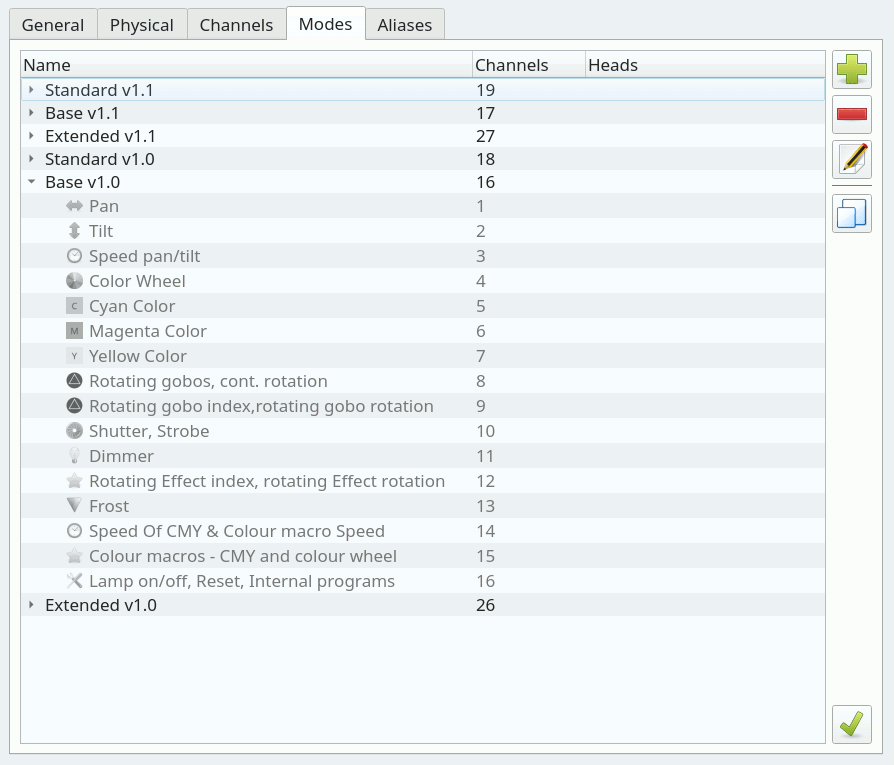
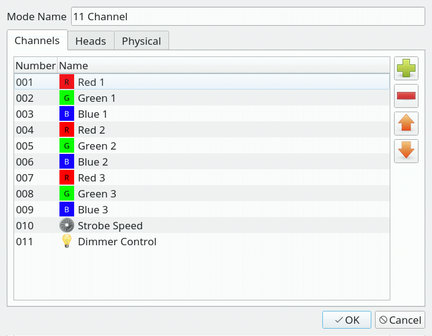
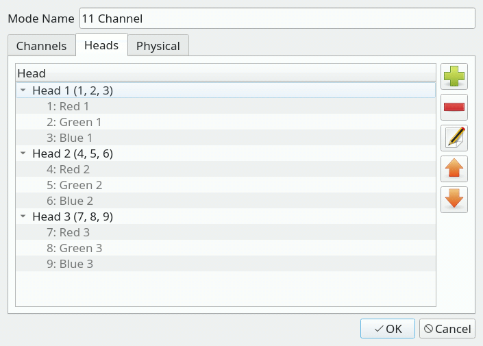
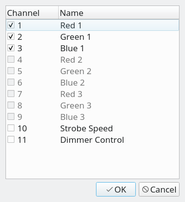

The modes tab contains all [modes](/basics/glossary-and-concepts#fixture-mode) the fixture can be configured to.

|     |     |
| --- | --- |
| **Mode list** | Displays all modes for the currently edited fixture. Each mode item can be opened to display the set and order of channels in that mode.* Name: The name of the mode (each name must be unique) * Channels: Number of channels in each mode * Heads: The number of light sources each mode supports |
|  | Create a new mode for the fixture, using the [Mode Editor](#mode-editor). |
|  | Remove the currently selected mode from the fixture. Removing a mode does not destroy any channels or other modes. |
|  | Edit the currently selected mode, using the [Mode Editor](#mode-editor). |
|  | Create a copy of the currently selected mode to the same fixture. Since modes are tightly coupled to a certain fixture's channels, modes cannot be copied across fixtures. |
|  | Open or close all mode items. |

Mode Editor
===========

The Mode Editor is used to create and edit [modes](/basics/glossary-and-concepts#fixture-mode) by picking sets of **Channels** in certain order (as defined by the fixture's manufacturer). Each editor window is divided into three tabs: Channels, Heads and Physical.

Channels Tab
------------

In the Channels tab you can place the fixture's channels in an order that forms an actual representation of the DMX channels that the fixture understands when it has been configured in that particular mode.

  

|     |     |
| --- | --- |
| **Mode Name** | The name of the mode (must be unique for each mode). |
| **Channel list** | Displays all channels present in the current mode in their proper order.   The "Acts on" column is used to bind a channel to another. For example a channel that controls the speed of a rotating gobo. |
|  | Add channels from the fixture's channel collection to the mode. You can create/edit channels in the [Fixture Definition Editor's](/fixture-definition-editor/channels) **Channels** tab.   When you click on this button a new window will be displayed, showing two lists:  * The list on the left shows the channels that have not yet been added to this mode. If you're creating a new mode, this list will show all the channels you created in the Fixture Editor's channels tab * The list on the right shows the channels that define the mode you're editing. If you're creating a new mode, this list will be empty.       Please note that the order of the channels in this list is fundamental to the fixture mode definition.  To move items from one list to another either use the central buttons or simply drag and drop them.   When done, press OK to update the mode channel list. |
|  | Remove the selected channels from the mode. Other modes' channel selections are left untouched. |
|  | Raise the selected channel up by one position. |
|  | Lower the selected channel down by one position. |

Heads Tab
---------

In the Heads tab you can define multiple [heads](/basics/glossary-and-concepts#head) for a single fixture, so that QLC+ knows to treat each of them individually in certain situations (such as [Fixture Groups](/basics/glossary-and-concepts#fixture-group)). If a fixture contains only one head when it's configured to use the currently edited mode (i.e. all of the mode's channels control one head at a time) there is no need to define the head. If, however, the fixture has multiple heads that you wish to be able to control, you must define each head here.

Heads don't have names as they can be thought of as simple "sub-fixtures" inside a fixture. Instead, they are automatically given index numbers. The ordering of the Heads should follow the physical fixture's configuration as closely as possible. So, if the heads go 1, 2, 3, 4 in the real world, don't define them as 4, 2, 1, 3 or something equally annoying.

  

|     |     |
| --- | --- |
| **Head list** | Displays the list of heads currently defined for the fixture. |
|  | Add a new head to the fixture, using the [Head Editor](#edit_head). |
|  | Remove the selected head from the fixture. |
|  | Edit the selected head using the [Head Editor](#edit_head). |
|  | Raise the selected head upwards by one. You can use this to change the order of the heads within the fixture. |
|  | Lower the selected head downwards by one. You can use this to change the order of the heads within the fixture. |

### Head Editor

The Head Editor is used to create and edit [heads](/basics/glossary-and-concepts#head) by picking sets of **Channels** that are dedicated to a single head (as defined by the fixture's manufacturer).

Editing a head is very simple: place a checkmark on each channel that is used ONLY by the head you are currently editing. Note that you should check the channels specific to a head, and nothing more. For example if there are 3 heads each with a dedicated dimmer control, then you should include the dimmer channel too. If, instead, the fixture has a single dimmer channel to control the intensity of all the heads together, then do not incude it in the head definition.

|     |     |
| --- | --- |
| **Channel list** | Displays the list of all fixture channels available in the current mode. Channels that have been assigned to another head are disabled and cannot be selected because each channel can only belong to one head at a time. |

Physical Tab
------------

This tab is identical to the _global_ [physical tab](/fixture-definition-editor/physical) found in the main Fixture editor windows.  
The only difference is that here you can choose if the mode you're editing has the same physical information or different ones.  
In the first case just leave the **"Use global settings"** option checked. If the mode exposes different properties, then check the **"Override global settings"** option and fill in all the information required.